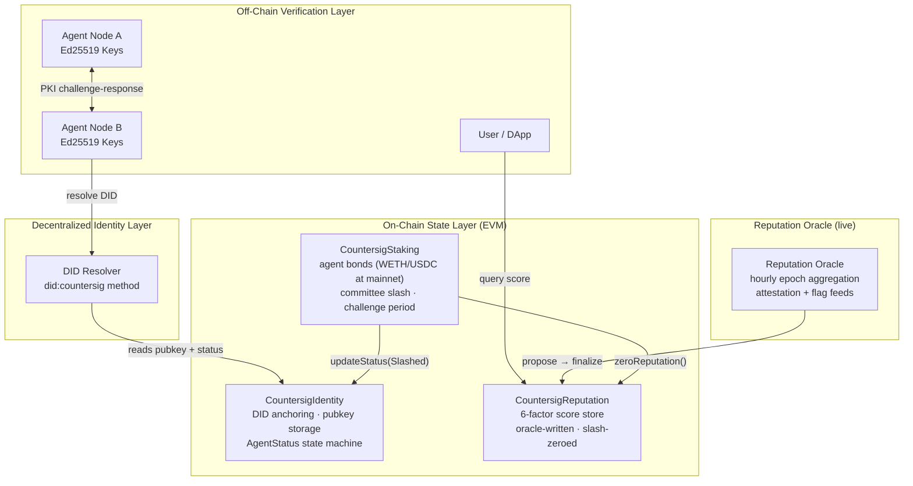
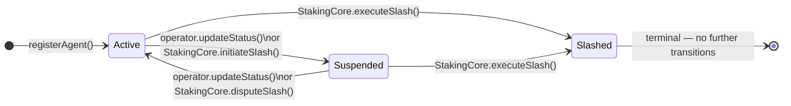
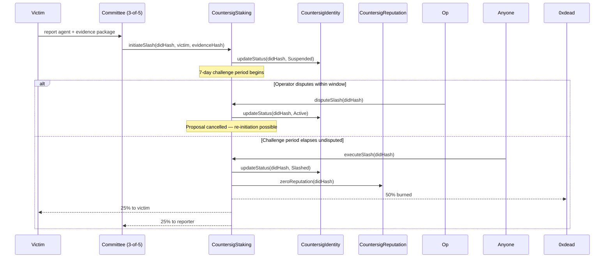
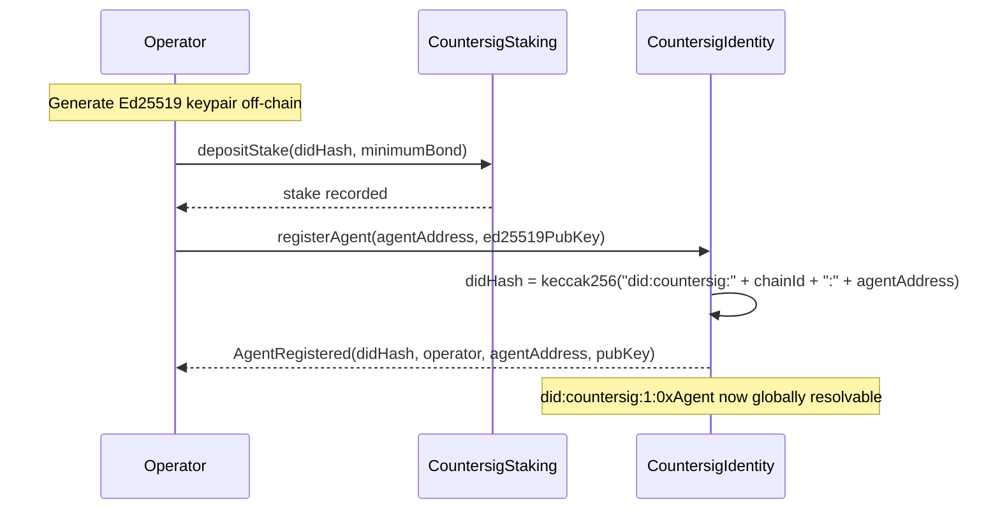
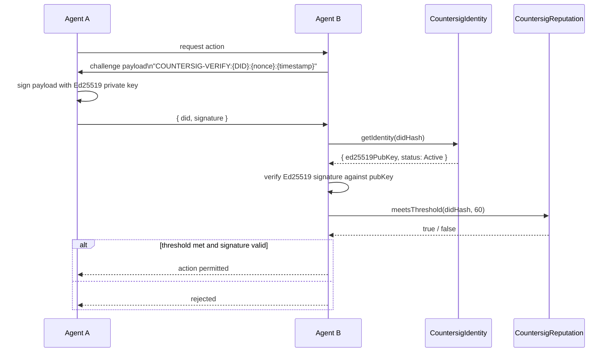
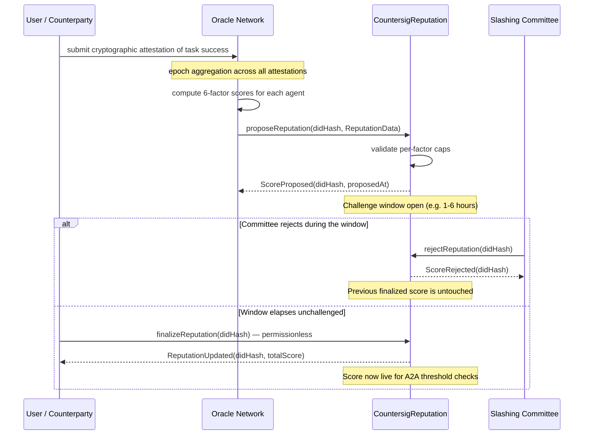

# Countersig Network

**Computed reputation and staked slashing for autonomous AI agents, on top of ERC-8004.**

As AI agents become independent economic actors, they need a trust score that means something and accountability that costs something. [ERC-8004](https://eips.ethereum.org/EIPS/eip-8004) gives agents a standard on-chain identity and a raw feedback ledger, but deliberately leaves out the hard parts: computing a trustworthy score from that feedback, and putting slashable stake behind it. Countersig is that layer. It takes ERC-8004 as the identity and feedback substrate, computes a normalized reputation score with an oracle, and enforces bonds and slashing — the accountability the standard omits. (Ed25519 PKI challenge-response for agent-to-agent auth rides alongside.)

> **There is no $CSIG token for sale — and no token launch is planned.** Countersig is an oracle and registry *service*, not a token. There has been no token generation event, no public sale, and no listing anywhere. Any tradeable token claiming to be "$CSIG" or "Countersig" on pump.fun or elsewhere is a scam and was not created by this team. Our brand assets were stolen for one such token. See [Direction: Oracle-First](docs/oracle-first.md) for why the token is deferred, and treat this repository and [countersig.network](https://countersig.network) as the only canonical sources.
>
> What *is* real: the protocol below is live on **Robinhood Chain testnet** (chain ID `46630`; see [`deployments/46630.json`](deployments/46630.json)), the reputation oracle runs an hourly scoring epoch against it, the [`@countersig/protocol-sdk`](https://www.npmjs.com/package/@countersig/protocol-sdk) is published on npm, and [CounterAudit](https://counteraudit.io) both consumes Countersig scores and feeds work-outcome attestations back into them. A legacy Sepolia deployment also remains.

### This repo vs. the Countersig SaaS platform

This repository (`countersig-network`) is the **decentralized protocol**: computed reputation and staked slashing on top of ERC-8004 identity, with no central authority. Trust here is enforced by cryptography and cryptoeconomics — nothing to sign up for, nothing to trust us on.

There is a **separate product**, the Countersig SaaS platform (repo: [`RunTimeAdmin/Countersig`](https://github.com/RunTimeAdmin/Countersig)), which ships its own npm packages — `@countersig/sdk`, `@countersig/verify`, `@countersig/mcp`, `@countersig/react`. That platform is a centralized, hosted NHI verification service. It is a different product with a different trust model, built by the same team, but it is **not this protocol** and does not read from or write to the contracts below.

If you're looking for MCP server support or React trust-badge components, those live in the SaaS repo, not here. If you're integrating with the on-chain protocol — DIDs, staked reputation, permissionless verification — you're in the right place, and `@countersig/protocol-sdk` is the only SDK for it.

## Documentation

| Guide | Audience |
|---|---|
| [Ecosystem Overview](docs/ecosystem.md) | Everyone — start here to understand the full picture |
| [Quickstart](docs/quickstart.md) | Developers — register your first agent in 10 minutes |
| [Robinhood Chain](docs/robinhood-chain.md) | Developers — deploy / test on Robinhood Chain (46630 / 4663) |
| [CounterAudit Integration](docs/counteraudit-integration.md) | Enterprise — embed agent identity in your audit trail |
| [AI Framework Integration](docs/ai-frameworks.md) | Developers — LangChain, AutoGen, CrewAI, Node.js |
| [Reputation Model](docs/reputation-model.md) | Everyone — how the 6-factor score works and grows |
| [Direction: Oracle-First](docs/oracle-first.md) | Everyone — why this ships as a service, not a token |

---

## Protocol Architecture



---

## Contracts

> **Identity layer: ERC-8004.** Countersig has adopted the [ERC-8004](https://eips.ethereum.org/EIPS/eip-8004) Identity Registry as the canonical agent registry and no longer maintains a competing one. Countersig is the **computed-reputation and staked-slashing layer on top of the standard** — the parts ERC-8004 deliberately leaves out. See [ADR 0001](docs/adr/0001-erc8004-as-identity-layer.md).

| Contract | Role |
|---|---|
| [`CountersigReputation`](src/CountersigReputation.sol) | **Computed-score anchor.** Stores the oracle's normalized, capped 6-factor score — the layer *above* ERC-8004's raw feedback. Exposes `getTotalScore()` and `meetsThreshold()` for on-chain consumers. |
| [`CountersigStaking`](src/CountersigStaking.sol) | **Staked accountability.** Agent bond management with committee-initiated slashing (7-day challenge window, permissionless execution after timelock). No ERC-8004 equivalent — this is the differentiator. Bond token is set by address at deploy: the testnet faucet token today, an established asset (WETH/USDC) at mainnet — the protocol never requires a native token. |
| [`CountersigIdentity`](src/CountersigIdentity.sol) | **Legacy.** Original `did:countersig` registry + on-chain Ed25519 PKI. Deprecated in favor of the ERC-8004 Identity Registry; kept for continuity of already-registered testnet agents. Its non-redundant part (the on-chain Ed25519 auth key + slash status) becomes an extension keyed to an ERC-8004 agent id. |

The retained contracts use UUPS upgradeable proxies (OpenZeppelin v5), controlled by a governance timelock on mainnet.

---

## DID Method (legacy)

> **Deprecated.** The `did:countersig` method below is retained for the testnet
> agents already registered on `CountersigIdentity`. New agents are identified by
> their ERC-8004 agent id; see [ADR 0001](docs/adr/0001-erc8004-as-identity-layer.md).

**Format:** `did:countersig:<chainId>:<agentAddress>`

**Example:** `did:countersig:1:0x1234...abcd`

The `didHash` index key is derived trustlessly on-chain at registration:

```solidity
bytes32 didHash = keccak256(
    abi.encodePacked("did:countersig:", block.chainid, ":", agentAddress)
);
```

Any party can reproduce the hash without querying contract state. The on-chain derivation prevents off-chain forgery.

### DID Document (resolved off-chain)

```json
{
  "@context": [
    "https://www.w3.org/ns/did/v1",
    "https://w3id.org/security/suites/ed25519-2020/v1"
  ],
  "id": "did:countersig:1:0x1234abcd",
  "controller": "did:pkh:eip155:1:0xOperatorAddress",
  "verificationMethod": [{
    "id": "did:countersig:1:0x1234abcd#key-1",
    "type": "Ed25519VerificationKey2020",
    "controller": "did:countersig:1:0x1234abcd",
    "publicKeyMultibase": "z6MkhaXgBZDvotDkL5257faiztiCEsJ"
  }],
  "authentication": ["did:countersig:1:0x1234abcd#key-1"],
  "assertionMethod": ["did:countersig:1:0x1234abcd#key-1"]
}
```

---

## Agent Status State Machine



Key invariants:
- Only `STAKING_CORE_ROLE` can set `Slashed`
- `Slashed` is terminal — no key rotation, no status change
- Suspended agents may rotate their Ed25519 key (key-compromise recovery path)

---

## Reputation System

Scores are computed off-chain by the oracle network and written to `CountersigReputation`. The contract stores and serves; it does not compute.

| Factor | Max | Source | Formula | Status |
|---|---|---|---|---|
| Fee Activity | 30 | Attestation volume (proxy for paid activity) | `min(30, floor(attestations / 10))` | live |
| Success Rate | 25 | Task attestations from consumers (e.g. CounterAudit) | `floor((successful / total) × 25)` | live |
| Age | 20 | Registration timestamp | `min(20, floor(log₂(days+1) × 4))` | live |
| External Trust | 15 | Normalized ERC-8004 feedback (linked agents) | mean of recognized tags × 15 | live |
| Community | 5 | Flags from watchdogs (e.g. HoodScan) | `max(0, 5 − flags × 2)` | live |
| Propagation | 5 | Agent-vouching trust graph | — | Phase 2 |
| **Total** | **100** | | | |

The age formula reaches 20 around day 31 (logarithmic). Only propagationScore is still inactive (0 today), so a live score currently maxes at 95; externalScore is 0 unless the agent links an ERC-8004 identity it owns. A new agent with no work history sits near the community baseline (5) and climbs only as real attestations and age accrue — which is what makes the number meaningful. Success/fee signals come from consuming platforms reporting job outcomes; community flags come from watchdog services reporting misbehavior; external trust comes from the agent's ERC-8004 feedback. See the [Reputation Model](docs/reputation-model.md) guide for provenance detail.

---

## Slashing Model

**Testnet:** 3-of-5 multisig `SLASHING_COMMITTEE`. **Mainnet path:** UMA OptimisticOracleV3 or Kleros (isolated in the `initiateSlash` / `disputeSlash` interface, replaceable without storage migration).

### Slash Lifecycle



### Slash Distribution

| Recipient | Share | Mechanism |
|---|---|---|
| `address(0xdead)` | 50% | Deflationary burn |
| Victim | 25% | Recourse for the harmed party |
| Committee reporter | 25% | Incentivizes accurate reporting |

---

## Protocol Flows

### Agent Registration



### Agent-to-Agent (A2A) Trust Verification



### Reputation Update Lifecycle (Optimistic Scoring)

Reputation updates go through a challenge window before taking effect, rather than writing atomically. This gives the slashing committee a chance to reject a bad proposal before it goes live, without needing a full multi-oracle consensus system.



---

## Key Rotation

If an Ed25519 private key is compromised:

1. Operator calls `updateStatus(didHash, Suspended)` immediately — invalidates the DID for authentication within one block.
2. Operator generates a new Ed25519 keypair off-chain.
3. Operator calls `rotatePublicKey(didHash, newEd25519PubKey)`.
4. Operator reinstates: `updateStatus(didHash, Active)`.

Slashed agents cannot rotate. The identity is permanently terminated.

---

## TypeScript SDK

```bash
npm install @countersig/protocol-sdk
```

### Agent-to-Agent authentication

```typescript
import { CountersigAgent, CountersigVerifier } from '@countersig/protocol-sdk';

// Agent A — the prover
const agentA = new CountersigAgent({
  privateKey: process.env.AGENT_A_ED25519_SEED,  // 32-byte hex seed
  agentAddress: '0xAgentAAddress',
  chainId: 46630,  // Robinhood Chain testnet
});

// Agent B — the verifier (has its own identity + a verifier for on-chain lookups)
const agentB = new CountersigAgent({
  privateKey: process.env.AGENT_B_ED25519_SEED,
  agentAddress: '0xAgentBAddress',
  chainId: 46630,
});
const verifier = new CountersigVerifier({
  rpcUrl: 'https://rpc.testnet.chain.robinhood.com',
  addresses: {
    identity: '0xCCF2Fd69c07EDFbc3C215cfD31e2F20FC208A16C',
    reputation: '0xbB0c9C2DF28af31905dEfEa04c80372C0909f1bF',
    staking: '0x7281cf35ae9Bf56EAF5B1d0C2C8e167e50BCEC75',
  },
  chainId: 46630,
});

// B issues a challenge to A
const challenge = agentB.issueChallenge(agentA.did);

// A signs and returns its DID + signature
const signature = agentA.signChallenge(challenge.payload);

// B verifies: resolves pubkey from chain, checks signature + reputation
const valid = await verifier.verifySignature(agentA.did, challenge.payload, signature);
const trusted = await verifier.meetsThreshold(agentA.did, 60);
```

### On-chain registration (operator)

```typescript
import { registerAgent } from '@countersig/protocol-sdk';

const { didHash } = await registerAgent(
  signer,                        // ethers.Signer with operator wallet
  agentA.did,                    // or just the agent's Ethereum address
  agentA.publicKeyBytes32,       // bytes32 Ed25519 public key
  IDENTITY_CONTRACT_ADDRESS
);
```

### DID Document resolution

```typescript
const didDoc = await verifier.buildDidDocument(agentA.did);
// Returns W3C-compliant DID Document with Ed25519VerificationKey2020
```

---

## Setup (contracts)

Requires [Foundry](https://getfoundry.sh).

```bash
git clone https://github.com/RunTimeAdmin/countersig-network
cd countersig-network
forge install
forge build
forge test
```

Running the fuzz suite at higher intensity:

```bash
FOUNDRY_PROFILE=ci forge test
```

---

## Access Control Summary

| Role | Holder (Testnet) | Permissions |
|---|---|---|
| `DEFAULT_ADMIN_ROLE` | Governance timelock | Grant/revoke all roles |
| `UPGRADER_ROLE` | Governance timelock | Authorize UUPS upgrades |
| `STAKING_CORE_ROLE` | `CountersigStaking` | Suspend / slash agents, zero reputation |
| `ORACLE_ROLE` | Oracle consensus contract | Write reputation scores |
| `SLASHING_COMMITTEE_ROLE` | 3-of-5 multisig | Initiate slash proposals |
| Operator | Agent registrant | Register, suspend, reinstate, rotate key |

---

## Ecosystem & Integrations

Countersig is designed as an open identity layer. Any system that needs to know *which* AI agent did *what* can integrate by querying the contracts or consuming CounterAudit enriched packets.

### CounterAudit

[CounterAudit](https://counteraudit.io) is the first integration partner, and it works in both directions. When an ingest call includes `agent_did`, CounterAudit queries the Countersig contracts at seal time and embeds the agent's identity and reputation score inside the AES-GCM seal, covered by an RFC 3161 timestamp — forensically proving what the agent's reputation was at the moment of each action. When that ingest also carries an `outcome` (`success` / `failure`) for a registered agent, CounterAudit reports it to the reputation oracle, so audited work outcomes feed back into the agent's Success Rate and Fee Activity factors. Reading and writing the same reputation closes the loop.

```typescript
// Every action your agent takes gets sealed with identity + reputation
await fetch('https://api.counteraudit.io/v1/audit/ingest', {
  method: 'POST',
  headers: { 'Authorization': `Bearer ${CA_API_KEY}`, 'Content-Type': 'application/json' },
  body: JSON.stringify({
    connector_id: 'my-agent',
    agent_did: 'did:countersig:46630:0x...',
    raw_event: { action: 'tool_call', tool: 'web_search', query: '...' },
  }),
});

// The sealed packet contains:
// agent_reputation_score: 47
// agent_identity_status: "Active"
// agent_identity_verified: true
// agent_enriched_at: "2026-06-30T16:33:39Z"
```

See the [CounterAudit Integration Guide](docs/counteraudit-integration.md) for full setup instructions.

### HoodScan

HoodScan is a rug-risk scanner for Robinhood Chain tokens. When a scan returns a red (high-risk) verdict, it reports the token's deployer address to the reputation oracle as a community flag. If that deployer operates a registered Countersig agent, the flag lowers its Community factor — so on-chain misbehavior detected off-chain shows up in the agent's reputation. This is the watchdog half of the signal loop: consumers attest to good work, scanners flag bad actors.

### On-chain consumers

Any smart contract can gate operations on an agent's reputation:

```solidity
ICountersigReputation rep = ICountersigReputation(REPUTATION_ADDRESS);
require(rep.meetsThreshold(didHash, 60), "insufficient reputation");
```

---

## Roadmap

| Phase | Timeline | Deliverables |
|---|---|---|
| Core Protocol | Q3 2026 | Robinhood Chain testnet (`46630`) · live reputation oracle · CounterAudit attestation + HoodScan flag feeds · `@countersig/protocol-sdk` v1.0 |
| External Trust | Q4 2026 | ~~externalScore from ERC-8004 feedback~~ **done** (linked agents, live) · agent-vouching graph (propagationScore) · deeper ERC-8004 interop (publish CounterAudit validations to the Validation Registry) |
| Mainnet Registries | Q1 2027 | Tier-1 security audit · registry deployment on Robinhood Chain mainnet (`4663`) with bonds and scoring fees in an established asset (WETH/USDC) — **no token launch; the oracle is the product** |
| Cross-Chain | Q2 2027 | Solana + Base state mirroring via LayerZero |

The token contracts (fixed-supply `CSIG`, vesting, public sale, operator bonds) are built and tested but intentionally shelved. They exist for one future — decentralizing the oracle operator set once scoring volume justifies multiple independent operators — not as a fundraising event. See [Direction: Oracle-First](docs/oracle-first.md).

---

## License

MIT
