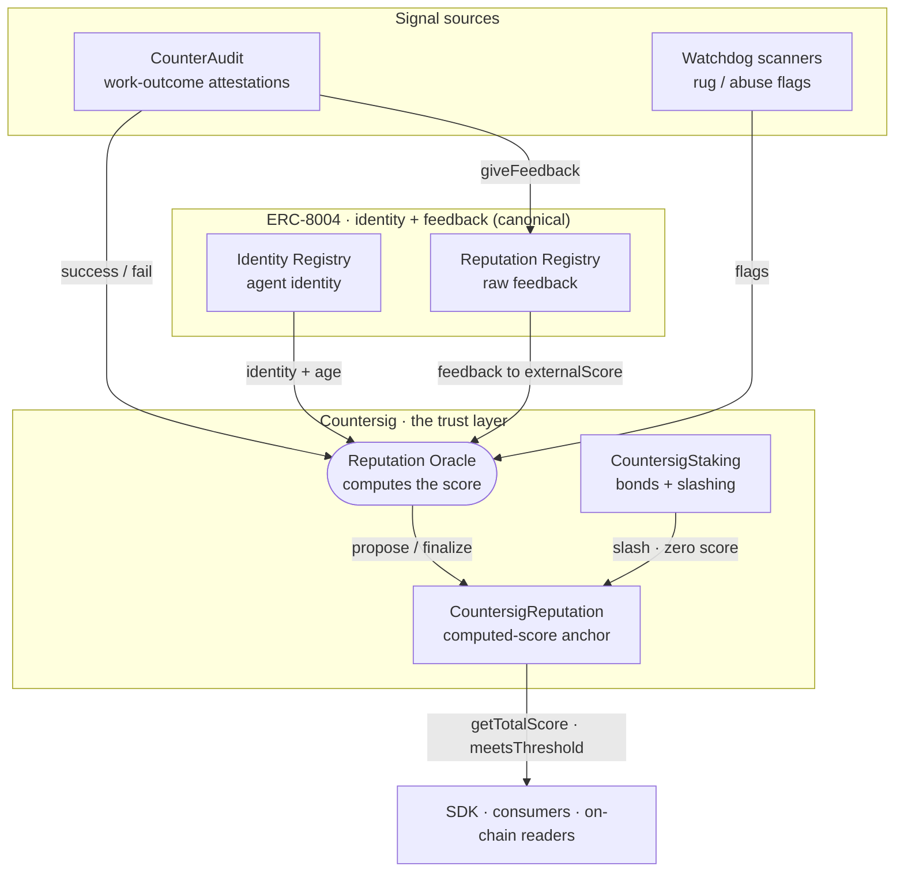

# Architecture — signal topology

Countersig is the **computed-reputation and staked-slashing layer on top of
[ERC-8004](https://eips.ethereum.org/EIPS/eip-8004)**. ERC-8004 provides the
canonical agent identity and a raw feedback ledger; Countersig turns that
feedback (plus its own signals) into one normalized score and puts slashable
stake behind it — the parts the standard deliberately leaves out. See
[ADR 0001](adr/0001-erc8004-as-identity-layer.md) for that decision.

Every path a trust signal takes:

## Signals in

The oracle recomputes every factor each epoch from observable data:

- **Attestations** — a consuming platform reports, per completed job, whether
  the agent succeeded or failed. [CounterAudit](counteraudit-integration.md) does
  this today; it drives the success-rate and fee-activity factors.
- **Flags** — watchdog scanners (e.g. rug detectors on the same chain) report
  misbehaving agents. Flags subtract from the community factor.
- **ERC-8004 feedback** — for an agent linked to an ERC-8004 identity it owns,
  the oracle reads that agent's on-chain feedback and normalizes the rating
  dimensions it recognizes into the external-trust factor (`externalScore`).
- **Identity + age** — the agent's registration and how long it has existed.

## Score out

The oracle proposes the computed score to `CountersigReputation`; after a
challenge window (rejectable) it finalizes on-chain. `CountersigStaking` can
slash a misbehaving agent, which zeroes its score. Consumers read the finalized
score with a single view call (`getTotalScore` / `meetsThreshold`).

## A deliberate loop-break

CounterAudit feeds the oracle directly (attestations → success factor) **and**
publishes outcomes to the ERC-8004 Reputation Registry (`giveFeedback`) for
ecosystem visibility. The oracle also reads ERC-8004 feedback for
`externalScore` — so CounterAudit's signal could enter a score twice. It does
not: CounterAudit's feedback carries a distinct `counteraudit` tag that the
`externalScore` normalizer excludes, so the circle is cut on purpose. No signal
is double-counted.
