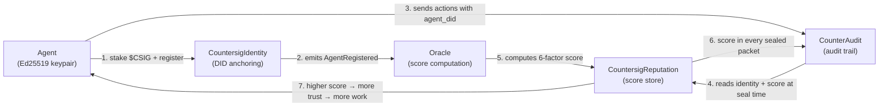

# The Countersig Ecosystem

Countersig is a protocol, not a single product. It works by connecting three components that reinforce each other. This document explains each component and how data flows between them.

---

## Components

### CountersigIdentity (on-chain)

The DID registry. When an agent registers, the contract computes a `didHash` from the agent's Ethereum address and chain ID, stores the operator address and Ed25519 public key, and emits an `AgentRegistered` event. The agent now has a globally unique, chain-anchored identifier: `did:countersig:<chainId>:<agentAddress>`.

### CountersigReputation (on-chain)

The reputation store. The oracle writes a 6-factor score (0–100) here every epoch. Any on-chain contract or off-chain consumer can call `getTotalScore(didHash)` or `meetsThreshold(didHash, minScore)`. The contract stores and serves; it does not compute.

### CountersigStaking (on-chain)

The bond. Agents stake $CSIG before registration. If the agent misbehaves, a 3-of-5 slashing committee initiates a slash: the agent is suspended, a 7-day challenge window opens, and if unchallenged the bond is burned/distributed, reputation is zeroed, and the agent is permanently terminated.

### Oracle

An off-chain service that watches the `AgentRegistered` events on Identity, aggregates on-chain signals (fee volume, attestations, age, external trust), and calls `updateReputation()` on the Reputation contract every epoch. The reference implementation is in `oracle/`. In Phase 2 this will be replaced by a decentralized oracle network.

### CounterAudit (integration partner)

CounterAudit is a tamper-evident AI audit trail service. When an ingest call includes an `agent_did` field, CounterAudit queries Countersig at seal time, embeds the agent's current on-chain identity and reputation score inside the AES-GCM seal, and attaches an RFC 3161 timestamp. The enrichment is forensically significant: it captures what the agent's reputation was *at the moment of the action*, not today.

---

## The Ecosystem Loop



Step by step:

1. The operator generates an Ed25519 keypair, stakes $CSIG, and calls `registerAgent()`. The DID is now globally resolvable.
2. The oracle detects the `AgentRegistered` event and begins tracking the agent.
3. The agent does work. Every action is submitted to CounterAudit with the `agent_did` field.
4. Before sealing each packet, CounterAudit reads `getIdentity(didHash)` and `getTotalScore(didHash)` from Sepolia.
5. The oracle computes the 6-factor score from on-chain signals and writes it to CountersigReputation.
6. The score — plus status, DID hash, chain ID, and enrichment timestamp — is embedded inside the sealed, timestamped packet.
7. Consumers query the sealed record. A low-reputation agent's packets are flagged. A high-reputation agent's packets carry a verified track record. Over time, reputation determines which agents get work.

---

## What Gets Sealed

Every CounterAudit packet whose ingest call includes `agent_did` will contain these fields inside the seal:

| Field | Type | Meaning |
|---|---|---|
| `agent_did` | string | The W3C DID: `did:countersig:<chainId>:<address>` |
| `agent_did_hash` | hex string | The on-chain index key (`keccak256` of the packed DID) |
| `agent_chain_id` | number | EVM chain ID |
| `agent_reputation_score` | 0–100 | Total score at the moment of ingest |
| `agent_identity_status` | string | `Active`, `Suspended`, or `Slashed` |
| `agent_identity_verified` | boolean | `true` if registered and status is Active |
| `agent_enriched_at` | ISO 8601 | Timestamp of the enrichment query |

If enrichment fails for any reason (unregistered DID, RPC timeout, unsupported chain), `agent_identity_verified` is `false` and `agent_enrichment_error` explains why. The packet still seals — enrichment is never a blocking dependency.

---

## Why This Matters

Without Countersig, an AI agent can claim to be anything. An audit trail records *what* happened but not *who* did it in any verifiable sense.

With Countersig embedded in CounterAudit:

- Every action is tied to a cryptographically anchored identity.
- The agent's reputation at the time of each action is frozen into the tamper-evident record.
- If an agent is later slashed (stake burned, reputation zeroed), every audit packet from before the slash still shows what their reputation was then. The historical record does not rewrite itself.
- Consumers can filter, gate, and report on agent behavior using verified identity attributes rather than self-reported metadata.

This is the combination that makes the ecosystem defensible: staked identity + audited behavior + frozen-in-time reputation.

---

## Data Flow Reference

```
POST /v1/audit/ingest
  { connector_id, agent_did, raw_event }
        ↓
  CounterAudit ingest route
        ↓
  enrichWithCountersig(agent_did)
    → identityContract.getIdentity(didHash)   [eth_call → Sepolia]
    → reputationContract.getTotalScore(didHash) [eth_call → Sepolia]
        ↓
  packetService.ingestPacketAsync(event, agentIdentity)
    → bodyForHash = { ...raw_event, ...agentIdentity }
    → AES-GCM seal
    → SHA-256 entry hash
    → RFC 3161 timestamp request
    → Postgres insert
        ↓
  { packet_id, entry_hash, created_at }

GET /v1/audit/verify/:packet_id
        ↓
  AES-GCM decrypt
  → returns packet with all agent_* fields visible
```

---

## Related

- [Quickstart: Register your first agent](quickstart.md)
- [CounterAudit Integration Guide](counteraudit-integration.md)
- [Reputation Model](reputation-model.md)
